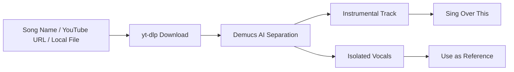
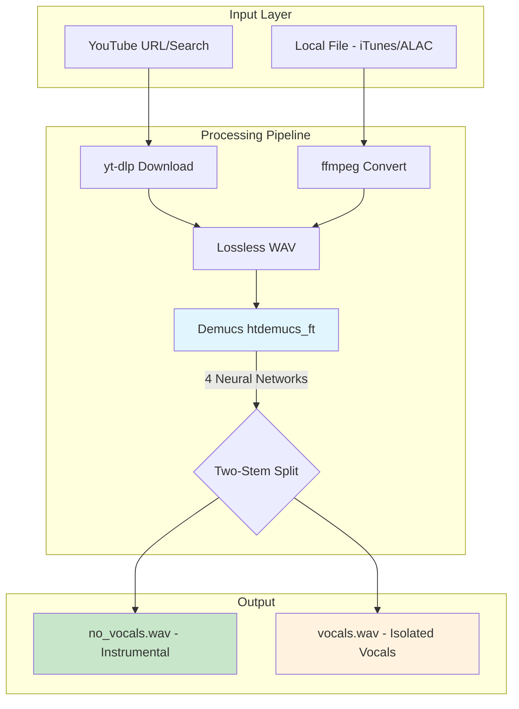
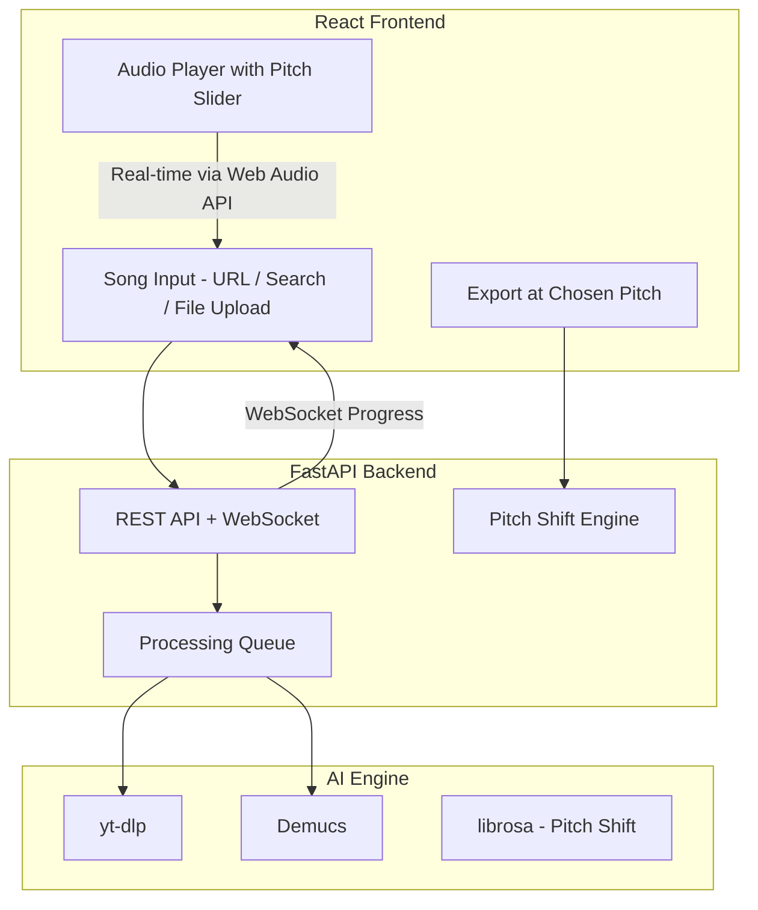

# Jiyajale

Turn any song into a karaoke track. Download from YouTube or use your own high-fidelity files (iTunes/ALAC), then let AI split the vocals from the instrumentals.

Built for mom's YouTube singing channel so she can sing over clean instrumentals of her favorite ghazals and Bollywood songs.

## How It Works



Under the hood, [Demucs](https://github.com/facebookresearch/demucs) (by Meta) runs 4 fine-tuned neural networks to separate the audio. It processes in ~6-second chunks on your GPU and produces studio-quality stems.

## Quick Start

### Prerequisites

- Python 3.13+
- ffmpeg (`brew install ffmpeg`)
- ~2GB disk for PyTorch + Demucs models (downloaded on first run)

### Setup

```bash
git clone https://github.com/upneja/jiyajale.git
cd jiyajale
python3.13 -m venv .venv
source .venv/bin/activate
pip install -r requirements.txt
```

### Usage (CLI)

```bash
# By song name (searches YouTube)
./separate.sh "Chupke Chupke Raat Din Ghulam Ali" "chupke-chupke"

# By YouTube URL
./separate.sh "https://youtube.com/watch?v=..." "song-name"
```

Output:
```
output/song-name/
  original.wav                              # Source audio
  stems/htdemucs_ft/original/
    no_vocals.wav                           # Instrumental - sing over this
    vocals.wav                              # Isolated vocals
```

Processing takes ~6-7 minutes per song on an M4 Mac.

## Architecture



## Tech Stack

| Component | Role |
|-----------|------|
| **[Demucs](https://github.com/facebookresearch/demucs) (htdemucs_ft)** | AI vocal/instrumental separation - fine-tuned variant for best quality |
| **[PyTorch](https://pytorch.org/) + MPS** | GPU acceleration on Apple Silicon |
| **[yt-dlp](https://github.com/yt-dlp/yt-dlp)** | YouTube audio download |
| **ffmpeg** | Audio format conversion |

## Roadmap

### Phase 2: Local Web App (Next)

A browser-based UI so mom can use this without the terminal:



- **Drag & drop** local files (iTunes purchases for best quality)
- **Real-time pitch slider** in the browser (Web Audio API, no round-trip)
- **Export at pitch** - bake the pitch change into a downloadable file
- **Song library** - browse all previously processed songs
- **Live progress** - WebSocket updates during processing

### Future Ideas

- Tempo adjustment (independent of pitch)
- Lyrics display synced to playback
- Favorites and playlists

## Background

Built in ~15 minutes with [Claude Code](https://claude.com/claude-code). See [WALKTHROUGH.md](WALKTHROUGH.md) for the full story of how it came together, and [PROCESS.md](PROCESS.md) for technical details.

## License

MIT
